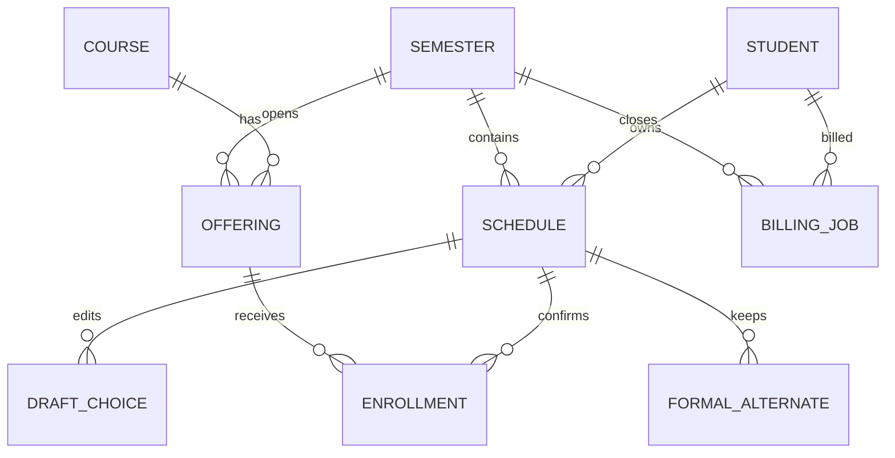

# 成员 1 核心设计说明

## 1. 模块边界

成员 1 维护 `Semester`、`Course`、`Offering`、`Schedule`、草稿、正式选课、正式备选与 `BillingJob` 的共同结构，以及 `registration` 服务中的选课和关闭事务。成员 3 在 `auth_contract.current_user` 位置接入真实会话；成员 4复用 `Grade` 提供先修数据，并消费 `BillingJob`，不能重新计算学费；成员 2 调用接口，不在页面复制业务校验。

## 2. 核心数据关系

草稿、正式主选和正式备选使用三张表，原因是失败提交必须保留旧的正式结果。`Enrollment` 冗余保存 `course_id` 并设置 `(schedule_id, course_id)` 唯一约束，数据库层也能阻止同一课程的两个班次同时成为正式结果。

## 3. 提交事务

写操作按以下顺序锁定：学期记录、方案记录、按 ID 升序排列的相关班次。取得班次锁后，后端重新统计最新人数，再检查状态、容量、先修、时间冲突和同课程重复。所有校验通过后才整体替换正式主选和正式备选；任一检查失败则由请求事务回滚，旧正式结果不变。

`Schedule.version` 是乐观版本号。页面提交其读取时的版本；不一致时返回“重新载入”，避免另一个页面退课后，旧页面又把课程静默选回。

SQLite 测试环境会忽略行级 `FOR UPDATE`，用于快速验证业务状态；`tests/test_mysql_concurrency.py` 已准备两个独立事务争抢最后名额的集成测试，只有配置名称以 `_test` 结尾的专用 MySQL 数据库才会运行。

## 4. 关闭事务

关闭取得学期排他锁，阻止新的选课和授课修改。当前按需求草稿中的授权解释执行：

1. 取消无教师班次，记录由系统取消造成的空缺。
2. 按最后成功提交时间、方案 ID 排序，依次尝试正式备选；此轮允许进入尚不足 3 人但有教师的班次。
3. 根据最新人数取消不足 3 人的班次，再记录这次系统取消造成的空缺。
4. 第二轮只尝试未取消且已有至少 3 人的班次，不复活已取消班次。
5. 固定最终课表和金额，创建 `(semester_id, student_id)` 唯一的账单任务，然后提交本地事务。

主动退课不会生成“待补空缺”，所以关闭时不会自动补回。重复关闭只返回已存在结果，不重复替补或创建账单。

## 5. 当前验证边界

自动测试已覆盖草稿不占名额、首次 4+2、成功提交、满员失败保留旧结果、退课不替补、旧版本冲突、时间冲突、先修课、顺序竞争最后名额、删除方案、关闭替补与账单幂等。真正的 MySQL 并发双连接测试已编写但尚无可用测试库执行；成员 3 的真实身份权限测试和成员 4 的账单发送重试测试仍需在对应模块接入后执行。
